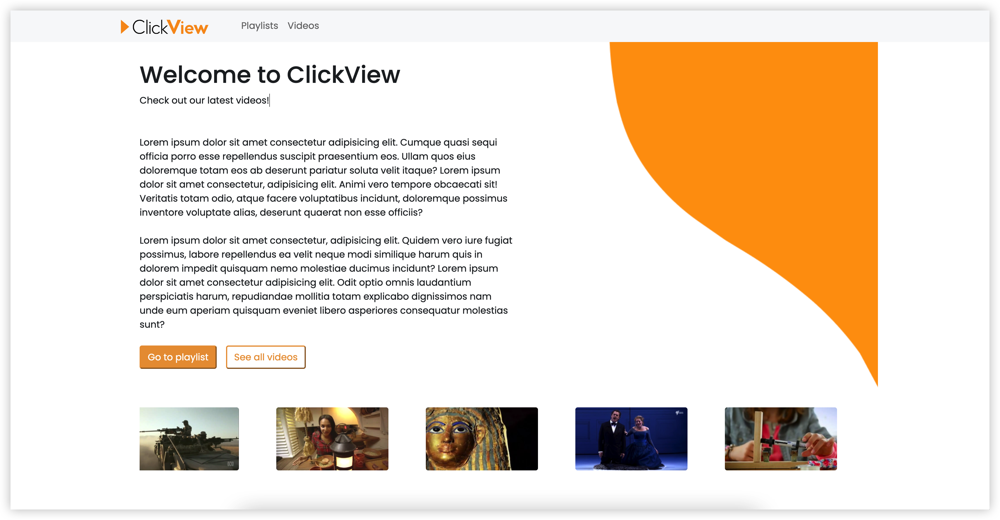

# ClickView Programming Practical

### ***You can visit the website here: <https://clickview-demo.netlify.app/>***

Please try and complete as much of this practical as possible in the allotted time. You will be judged on your overall design skills, use of language best practices, code reuse, and design patterns. Keep in mind that this is not an assignment and there are no strict marking criteria or rules. We are simply looking for a demonstration of your ability to design and implement software.

## Background

ClickView enables educators to manage media across many platforms. One component of this, is allowing educators to create and manage playlists of videos.

## Overview

For this practical, we have provided you with the skeleton of a React application for managing playlists of videos. You are tasked with building out this application so that it is fully featured, allowing users to:

- Browse videos and playlists
- Create playlists
- Delete playlists
- Add videos to playlists
- Remove videos from playlists.

**Note**

- Please ensure that you have installed the LTS versions of Node and NPM before proceeding with the practical.
- Please do not modify the `playlists.json` and `videos.json` files as these contain the initial data for your application. Feel free to modify any other files we have provided you with.
- We encourage you to attempt the practical with TypeScript, but if you are more comfortable using JavaScript then feel free to use that.

## Task 1: Set up a public git repository and commit the downloaded files

You will submit your code to us via a public git repository. We strongly recommend using GitHub or GitLab, but any public git provider is acceptable.

Start out by committing this codebase in the state that you downloaded it in. **Please commit your code at the end of every task.**

## Task 2: Display the videos and playlists

We have provided you with 2 json files containing your initial data:

- `/public/videos.json`
- `/public/playlists.json`

We have also provided you with some pre-made routes:

- One for browsing videos
- One for browsing playlists
- One for browsing all videos within a playlist

Using the pre-made `playlist-item` and `video-item` components, update these routes to display the appropriate data.

## Task 3: Playlist creation/deletion

Add support for creating new playlists, and deleting existing playlists.

## Task 4: Video management in playlists

Add support for adding videos into playlists, and removing videos from playlists.

Note: Please ensure that videos cannot be added to a playlist more than once.

## Task 5: Provide bulk actions [Optional]

Add functionality for users to be able to add multiple videos to playlists at once using checkboxes. Also, offer the same functionality but for removing videos from playlists where appropriate.

For example, I should be able to "check" a selection of videos from a video list page, and then easily be able to add all of those videos to playlists with 1 action.

## Task 6: Get creative [Optional]

If you find yourself with leftover time, feel free to try to impress us with some creativity. There is room in this application for improvements, and we would love to see what you can come up with. For example, adding pagination to the video lists, adding sorting, etc.# ClickViewInterview
